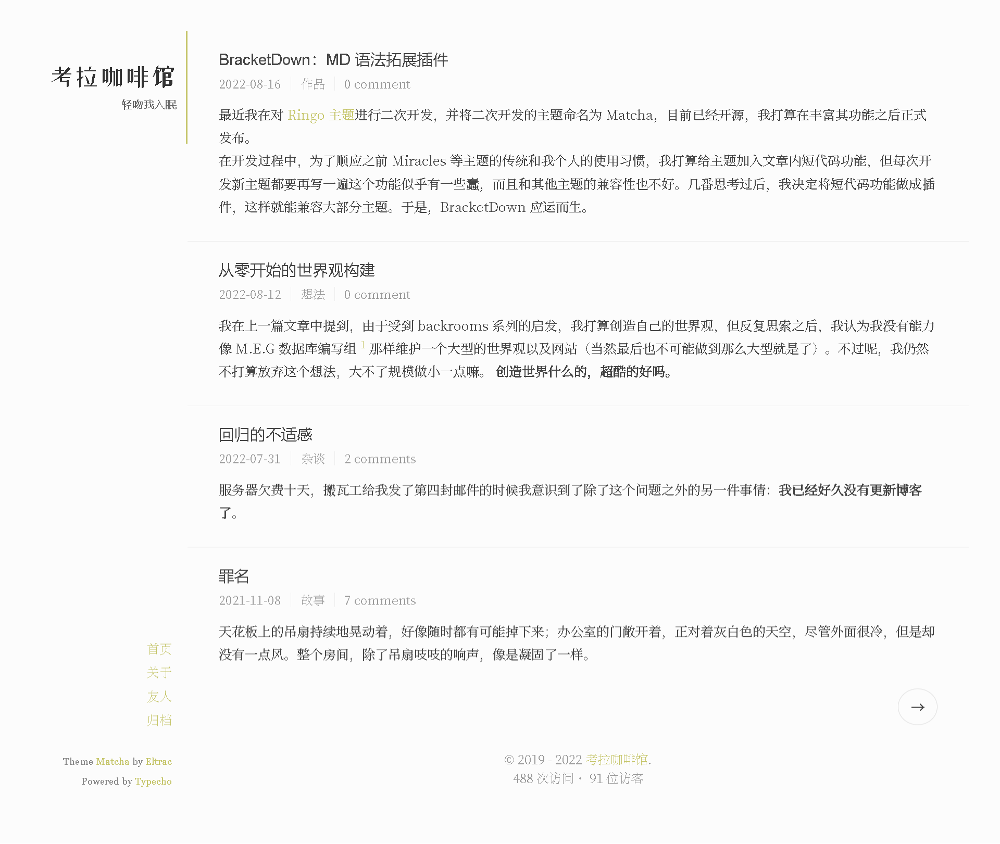

# Theme Matcha

 
 

Matcha 是基于 [Ringo](https://github.com/memset0/typecho-theme-ringo) 二次开发的 Typecho 主题，而 [Ringo](https://github.com/memset0/typecho-theme-ringo) 本身是移植自 Hexo 的 [Journal](https://github.com/SumiMakito/hexo-theme-Journal) 主题。总体上来讲，Matcha 是基于 Ringo 的代码和 Journal 的设计进行二次创作的，对代码结构进行了大幅度地重构，并添加了许多自己的设计和好用的功能。

## 特色

- **响应式设计**，在常见的屏幕尺寸下表现良好
- **全站无刷新**，应用了 Pjax 和 Ajax，切换页面和发表评论时更流畅
- **支持夜间模式**，可以自动和手动切换日间/夜间模式
- **平滑滚动**，翻阅页面时滚动更加自然
- **图片懒加载**，延迟加载图片，提升页面速度
- **图片灯箱**，点击图片可放大查看
- **文章目录**，使用 tocbot 生成的动态文章目录，支持二三级标题
- **更好的代码高亮**，自动生成行号，附带一键复制按钮
- **更好的字体**，借助 Google Font，采用思源系列字体
- **访客统计**，即插即用的统计功能
- **文章阅览量统计**，查看有多少人点开了你的文章
- **人性化的时间显示**，是今天、昨天，还是几天前，而不是枯燥的日期
- **增强可读性**，精心设计的文字排版
- **良好的兼容性**，兼容各类插件，继承曾使用过的主题数据
- **专注模式**，阅读时点击文章标题上的眼睛，隐藏文章以外的内容
- More to find

具体的外观可以访问[我的博客](https://blog.guhub.cn/)查看。

## 使用

1. 前往 [Releases](https://github.com/BigCoke233/matcha/releases) 页面
2. 找到最新的发行版，即第一个 Release
3. 下载打包好的 `.zip` 压缩文件
4. 解压到 `usr/themes/` 目录
5. 登陆后台启用主题并更改设置

使用开发版

1. 直接 `clone` 或者下载仓库 `main` 分支
2. 将文件夹重命名为 `matcha`
3. 将主题文件夹放入主题安装目录 `/usr/themes/`
4. 登陆后台启用主题并更改设置

查看历史版本和更新日志

所有版本的更新日志请查看 [change-log.md](change-log.md)。

Matcha 主题采用[语义化版本 2.0.0](https://semver.org/lang/zh-CN/) 标准发行版本号，所有 Releases 页面的发行版都遵循这一规范，除此之外，主题会为每一个次级版本命名来概述此次更新（当然并不重要）。开发版的语义化版本号，也就是 GitHub 仓库里没有被特别赋予版本号的的版本，为 `当前最新发行版版本号-alpha.最近一次 commit 的哈希码前七位`，例如[这一个 commit](https://github.com/BigCoke233/matcha/commit/1c32e661d5048530ec19df692f97ab8c1a895d4c)的版本号为 `1.0.0-alpha.3b87366`。

### 说明

如果在使用过程中遇到任何问题，请先查看[说明文档](https://matcha.guhub.cn/)或 [FAQ](doc.md)，若没能解决，再询问作者。 
你也可以加入 QQ 群（924171480）与各路大佬交流。当然这并不是主题用户交流群，只要是与我作品相关的内容都可以在群里讨论，就当作是一个随意的交流群吧。

### 拓展

这些插件可以拓展主题的功能，并且主题已经适配了它们，可以放心使用

- [Links](http://www.imhan.com/archives/typecho_links_20141214/)：友情链接插件，如果要使用友情链接功能就必须安装这个插件
- [Sticky](https://github.com/jazzi/sticky-for-typecho)：文章置顶插件，如果想要置顶一篇或多篇文章就可以使用这个插件
- [BracketDown](https://github.com/BigCoke233/typecho-plugin-BracketDown)：语法拓展插件，如果想要在文章里使用短代码就需要安装这个插件
- [CopyDog](https://github.com/BigCoke233/typecho-plugin-CopyDog)：版权狗插件，可以在文章末尾生成一个显示版权信息的卡片
- [ExSearch](https://github.com/AlanDecode/Typecho-Plugin-ExSearch)：搜索增强插件 _1.2.0-beta.1 及以后版本支持_
- [WordsCounter](https://github.com/elatisy/Typecho_WordsCounter)：字数统计插件，可以统计全站的字数

## 鸣谢

#### 开源项目

[jQuery](https://jquery.com/) | 
[jQuery Lazy](http://jquery.eisbehr.de/lazy/) |
[Pjax](https://github.com/defunkt/jquery-pjax) | 
[Prism.js](https://prismjs.com/) | 
[smoothscroll.js](https://www.smoothscroll.net/) | 
[bigfoot.js](http://bigfootjs.com/) | 
[toaster.js](https://github.com/bigcoke233/toaster.js) | 
[Fluidbox](http://terrymun.github.io/Fluidbox/demo/index.html) | 
[Throttle-Debounce](https://benalman.com/projects/jquery-throttle-debounce-plugin/) | 
[tocbot.js](https://tscanlin.github.io/tocbot/)

#### 矢量图

[Pixabay 用户 - OpenClipart-Vectors](https://pixabay.com/zh/vectors/screaming-surprised-smiley-emotion-146426/)：提供 404 页面使用的矢量图

#### 公益CDN

[Cravatar](https://cravatar.cn/)  | 
[cdnjs](https://cdnjs.cloudflare.com/)  | 
[字节跳动静态资源公共库](https://cdn.bytedance.com/)

---

Copyright &copy; 2022 SumiMakito, memset0 & Eltrac, under GPL v3.0 License.
